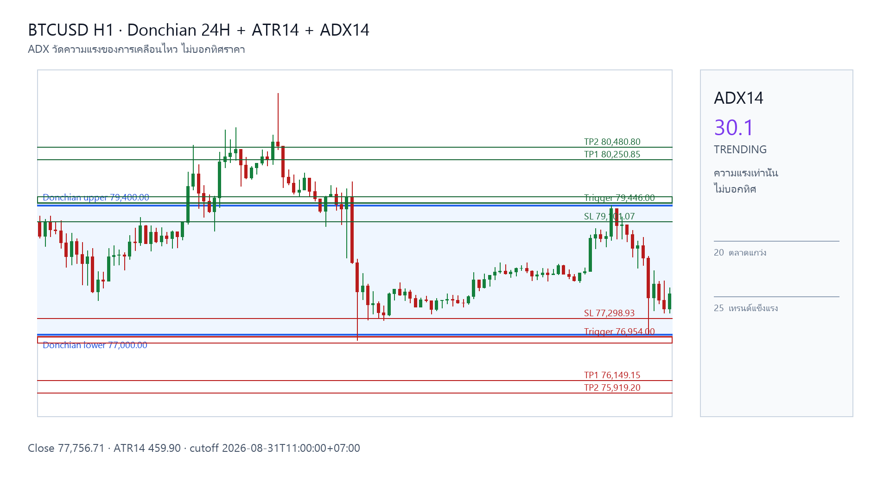

# วิเคราะห์ BTCUSD H1 วันนี้ 2026-08-31: แผนสองฝั่งจากกรอบ Donchian

&emsp;รอบนี้มีแผนเฝ้ารอทั้ง Long และ Short จากกรอบราคาล่าสุด โดยฝั่งที่นำเสนอเป็นลำดับแรกคือแผนซื้อตามโครงสร้างราคา ไม่ใช่คำสั่งให้เข้าเทรดทันที

## BTCUSD H1 กับกรอบ Donchian วันนี้

&emsp;ราคาปิดล่าสุดอยู่ที่ 77,756.71 ดอลลาร์ ขณะที่กรอบ Donchian 24 ชั่วโมงมีขอบบน 79,400.00 และขอบล่าง 77,000.00 ดอลลาร์ จึงใช้สองระดับนี้เป็นฐานหา Trigger รอบถัดไป
- **ATR14:** 459.90 ดอลลาร์ ใช้วัดระยะความผันผวน ไม่ใช่ตัวบอกทิศ
- **ADX14:** 30.1 (ก่อนหน้า 29.2; ความแรงของแนวโน้มอยู่ในระดับสูง; เพิ่มขึ้นจากแท่งก่อน) — ADX วัดความแรง ไม่บอกว่าราคาจะขึ้นหรือลง
- **โครงสร้างราคา:** โครงสร้างยังผสม ใช้จัดลำดับการอ่านแผนเท่านั้น ไม่ตัดแผนฝั่งใดทิ้ง

## แผน Long และ Short วันนี้

&emsp;ทั้งสองแผนเป็นเงื่อนไขรอแท่ง H1 ปิดผ่านระดับที่กำหนด จากนั้นรอราคากลับมาทดสอบโซน Entry ก่อนพิจารณาการจับคู่จริง หากอีกฝั่ง Trigger ก่อน ให้ยกเลิกอีกฝั่งจนถึงรอบวันถัดไป

### แผน Long (ซื้อ)
- **Trigger:** แท่ง H1 ปิดเหนือ 79,446.00
- **Entry หลัง retest:** 79,446.00–79,560.98
- **Stop Loss:** 79,101.07
- **TP1 / TP2:** 80,250.85 / 80,480.80
- **RR โดยประมาณ:** 1.50 / 2.00
- **เงื่อนไข:** ห้ามไล่ราคา หากราคาห่างจากโซนเกิน 1 ATR; แท่งที่ Trigger ยังไม่นับเป็น retest และการแตะโซนไม่ยืนยันการจับคู่จริง

### แผน Short (ขาย)
- **Trigger:** แท่ง H1 ปิดต่ำกว่า 76,954.00
- **Entry หลัง retest:** 76,839.02–76,954.00
- **Stop Loss:** 77,298.93
- **TP1 / TP2:** 76,149.15 / 75,919.20
- **RR โดยประมาณ:** 1.50 / 2.00
- **เงื่อนไข:** ห้ามไล่ราคา หากราคาห่างจากโซนเกิน 1 ATR; แท่งที่ Trigger ยังไม่นับเป็น retest และการแตะโซนไม่ยืนยันการจับคู่จริง

&emsp;ระดับทั้งหมดเป็นแผนเชิงเงื่อนไข ต้องคำนวณ RR ใหม่จากราคาจับคู่จริง รวมค่าธรรมเนียม spread และ slippage และ Stop Loss ไม่ใช่ราคาที่รับประกันการจับคู่

[ดูกราฟ BTCUSD](/thailand/asset-btc) หรือ [อ่านบทวิเคราะห์ล่าสุด](/thailand/analysis)
