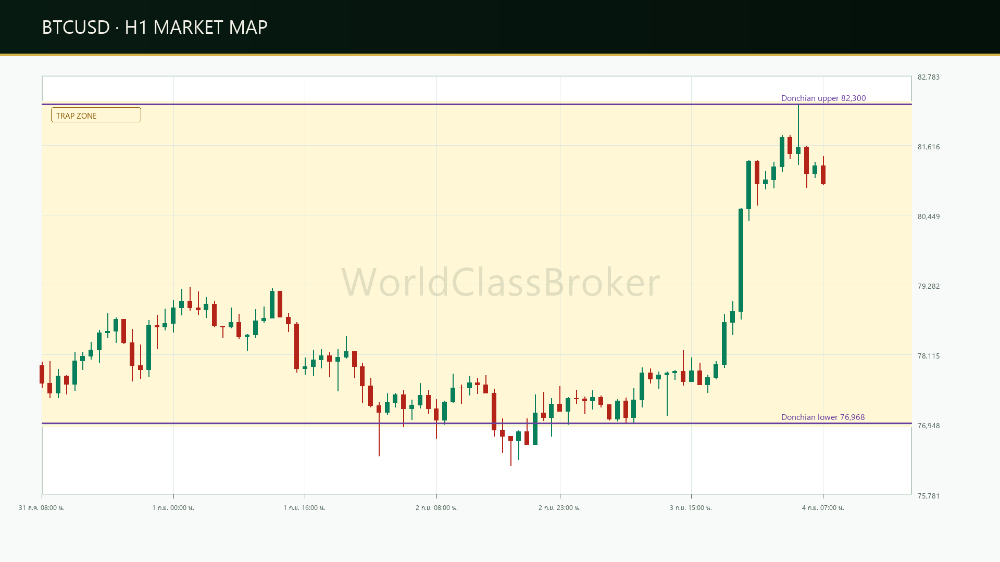
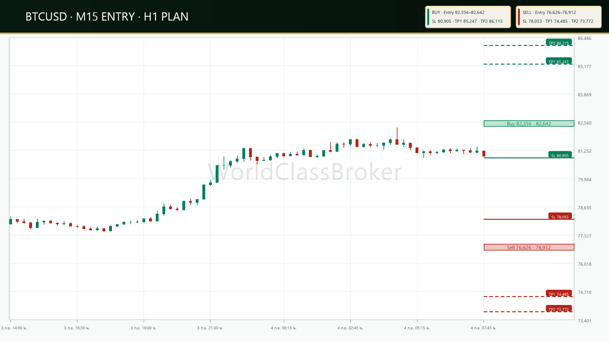

# วิเคราะห์ BTCUSD (H1) ประจำวันที่ 04/09/2026: แผนสองฝั่งจากกรอบ Donchian

&emsp;เมื่อดู [กราฟ BTCUSD แบบเรียลไทม์](/thailand/asset-btc) บนไทม์เฟรม H1 ราคาปิดล่าสุดอยู่ที่ 80,972 ดอลลาร์ โดยใช้โครงสร้างราคาและ Donchian เป็นกรอบอ่านบริบท

&emsp;แผนวันนี้รอแท่ง H1 ปิดยืนยัน Trigger ก่อนพิจารณา Retest ในโซน Entry ทั้ง BUY และ SELL; ระดับทั้งหมดมาจาก canonical ADR14 policy เดียวกัน

## บริบทราคาและอินดิเคเตอร์ชี้วัด

* **ระดับราคาปิด H1 ล่าสุด:** 80,972 ดอลลาร์
* **กรอบ Donchian 24 ชม.:** ขอบบน 82,300 ดอลลาร์ และขอบล่าง 76,968 ดอลลาร์
* **ความกว้างกรอบ:** 5,332 ดอลลาร์ ใช้ประกอบการประเมินระยะ ไม่ใช่สัญญาณเข้า
* **ADX (14):** 42 และ ATR (14): 564 ดอลลาร์ ใช้เป็นบริบทความแรงและความผันผวน
* **โครงสร้างราคา:** โครงสร้างขาขึ้น

## แผนการเทรดรายวัน

&emsp;รอแท่ง H1 ปิดยืนยัน Trigger ก่อน แล้วจึงพิจารณา Retest ใน Entry zone; หากฝั่งใด Trigger ก่อน ให้ยกเลิกอีกฝั่งตามกฎ OCO

&emsp;Trap Zone อยู่ระหว่าง Trigger SELL 76,912 และ Trigger BUY 82,356 ดอลลาร์; Donchian lower 76,968 และ upper 82,300 เป็น reference ไม่ใช่สัญญาณเข้าโดยลำพัง. OCO หมายถึงเมื่อฝั่งหนึ่ง Trigger อีกฝั่งถูกยกเลิก

## แผนสำรองกรณีเกิด False Breakout

* **Bull Trap:** หาก H1 ปิดเหนือ 82,356 แล้วกลับเข้ากรอบ ให้ยกเลิก BUY และรอข้อมูลแท่งปิดใหม่
* **Bear Trap:** หาก H1 ปิดต่ำกว่า 76,912 แล้วกลับเข้ากรอบ ให้ยกเลิก SELL และรอข้อมูลแท่งปิดใหม่
* ไม่ไล่ราคาเมื่อไม่มี Retest; ประเมินแผนใหม่เมื่อโครงสร้างและแท่งปิดเปลี่ยน

## เงื่อนไขการเข้าเทรด

&emsp;ระบบใช้ OCO และยืนยันด้วยแท่ง H1 ปิดตาม closed_h1_strict_cross ก่อนวางแผน Retest; Entry, SL, TP1 และ TP2 เป็นระดับจาก ADR14 canonical policy
&emsp;ADR14 = 2,855 ดอลลาร์ จากข้อมูลวันปิดสมบูรณ์ 82 วัน; policy ใช้ Entry width 0.10, risk floor 0.50 และ cap 1.00 ของ ADR14

สามารถอ่าน [บทวิเคราะห์เทคนิคทั้งหมด](/thailand/analysis) เพื่อเปรียบเทียบบริบทเพิ่มเติม

> ### ข้อมูลสัญญาแผนเทรดสาธารณะ (Public Execution Contract)
>
> - **Side:** OCO | **Status:** WAIT_TRIGGER
> - **BUY Trigger:** `closed_h1_strict_cross` @ 82,356 | **Entry:** 82,356–82,642 | **SL:** 80,905 | **TP:** 85,247 / 86,115
> - **SELL Trigger:** `closed_h1_strict_cross` @ 76,912 | **Entry:** 76,626–76,912 | **SL:** 78,053 | **TP:** 74,485 / 73,772
> - **Invalidation:** Closed H1 Reaches SL After Trigger
> - **Cutoff:** 2026-09-04T08:00:00+07:00 | **Valid Until:** 2026-09-05T08:00:00+07:00
> - **Evidence Hash:** `2eb31ad4804afa855f46c3907e9f92122a00c3c0e635b3a29b7350f11ce30905`